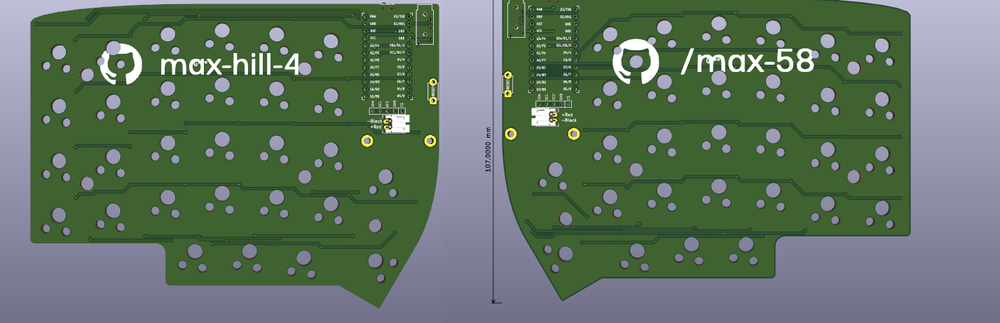

# Max58

[]

This is an edited Allium58 with my GitHub printed on the silk screen. All credits go to beekeeb.

I used this [element14](https://community.element14.com/members-area/b/blog/posts/kicad-6---adding-logos-and-graphics-to-a-silkscreen) article to do this.

Please find the original repo for further details.

Have a good day :)

## Credits

This open source hardware project is created by [beekeeb](https://beekeeb.shop) and other contributors. It is based on [Lily58 Pro created by kata0510](https://github.com/kata0510/Lily58/tree/master/Pro).

